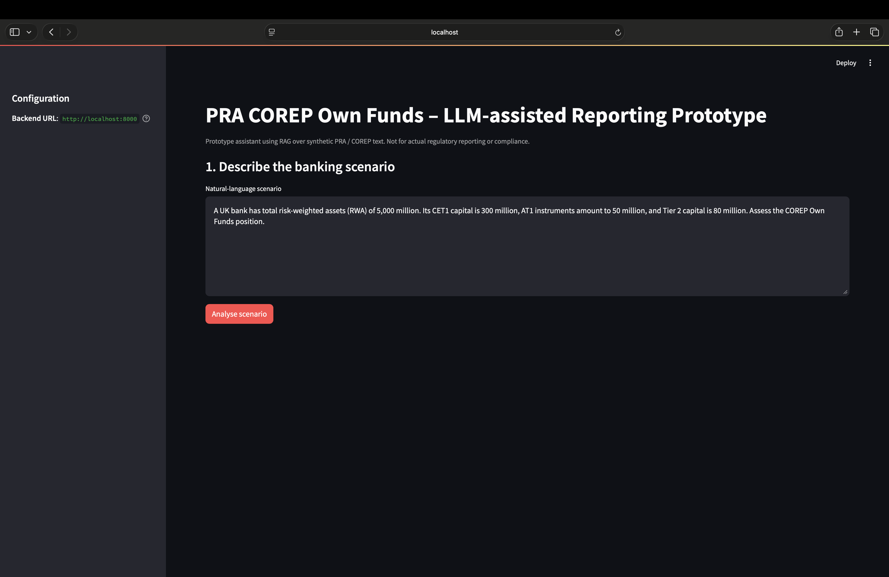
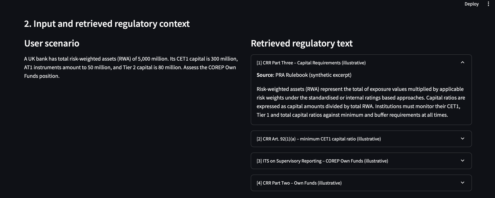
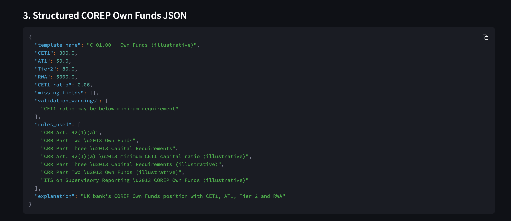
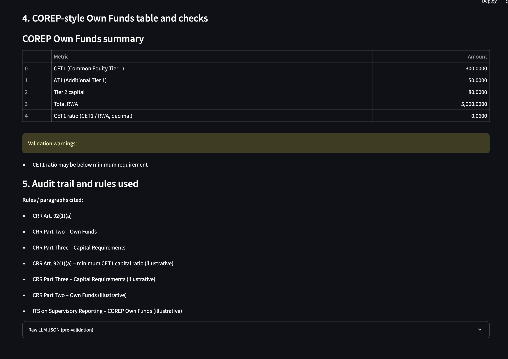

This project was developed as part of an internship assessment to demonstrate an end-to-end LLM-assisted regulatory reporting workflow for PRA COREP Own Funds.

The goal is to show how retrieval-augmented generation (RAG), structured reasoning, validation logic, and explainability can be combined in a practical fintech prototype.

## PRA COREP Own Funds LLM-Assisted Reporting Assistant

This is a prototype **LLM-assisted PRA COREP Own Funds reporting assistant** built with:

- **Backend**: FastAPI, LangChain, ChromaDB, Groq/OpenAI embeddings

- **Frontend**: Streamlit
- **Language**: Python

It accepts a natural-language banking scenario, retrieves relevant PRA Rulebook / COREP Own Funds instruction snippets using RAG, calls an LLM to propose structured Own Funds data, then performs deterministic Python validation and displays the result in a COREP-style view.

> **Important**: This is a technical prototype only. It is **not** legal, regulatory, or supervisory advice and must not be used for actual regulatory reporting.

---

### 1. Project Structure

- **`backend/`**
  - `app/main.py` – FastAPI application and API endpoints
  - `app/config.py` – Settings and environment configuration
  - `app/models.py` – Pydantic models for requests and responses
  - `app/validation.py` – Deterministic Own Funds validation logic
  - `app/rag.py` – LangChain RAG pipeline + ChromaDB integration
  - `app/__init__.py` – Package marker
- **`ui/`**
  - `app.py` – Streamlit frontend application
- **`requirements.txt`** – Python dependencies
- **`README.md`** – This file

ChromaDB uses a **local persistent directory** (`.chroma/`) to store vectors.

---

### 2. Prerequisites

- Python **3.10+** (recommended)
- An **OpenAI API key**

Set your API key as an environment variable:

```bash
export OPENAI_API_KEY="sk-..."
```

Optional environment variables:

- `OPENAI_MODEL` – default: `gpt-4o-mini`
- `COREP_BACKEND_HOST` – default: `http://localhost:8000`

You can put these into a `.env` file in the project root and use `python-dotenv`, or export them directly in your shell.

---

### 3. Installation

From the project root:

```bash
python -m venv .venv
source .venv/bin/activate  # On Windows: .venv\Scripts\activate

pip install --upgrade pip
pip install -r requirements.txt
```

---

### 4. Running the Backend (FastAPI)

From the project root:

```bash
uvicorn backend.app.main:app --host 0.0.0.0 --port 8000 --reload
```

This starts the FastAPI server on `http://localhost:8000`.

You can check the interactive API docs at:

- Swagger UI: `http://localhost:8000/docs`
- ReDoc: `http://localhost:8000/redoc`

---

### 5. Running the Frontend (Streamlit)

In a separate terminal, from the project root:

```bash
streamlit run ui/app.py
```

By default, the UI expects the backend at `http://localhost:8000`. If you host the backend elsewhere, set:

```bash
export COREP_BACKEND_HOST="http://your-backend-host:8000"
```

---

### 6. End-to-End Flow

1. **User scenario input** (Streamlit):
   - Example: *"UK bank with £5bn RWA, CET1 capital of £300m, AT1 of £50m, Tier 2 of £80m."*
2. **Backend RAG retrieval** (FastAPI + LangChain + ChromaDB):
   - Scenario is embedded and used to retrieve relevant PRA / COREP-like snippets from ChromaDB.
3. **LLM inference**:
   - The retrieved context and scenario are passed to an LLM (OpenAI) with a constrained JSON schema.
4. **Deterministic validation** (Python):
   - Computes \( \text{CET1\_ratio} = \frac{\text{CET1}}{\text{RWA}} \)
   - Enforces minimum CET1 ratio of **4.5%**
   - Identifies **missing numeric inputs** (CET1, AT1, Tier2, RWA)
   - Adds **validation warnings** as needed
5. **UI rendering** (Streamlit):
   - Displays:
     - User input
     - Retrieved regulatory text
     - Strict structured JSON
     - Validation warnings
     - COREP-style Own Funds table
     - Audit trail including cited rules

---

### 7. Notes on the RAG Corpus

For the prototype, a **small synthetic corpus** is embedded into ChromaDB at startup to simulate PRA Rulebook / COREP Own Funds instructions (e.g., CET1 minimum ratio, definitions of own funds components). In a real deployment you would:

- Replace the synthetic snippets with properly licensed PRA Rulebook / COREP texts.
- Implement a robust ingestion pipeline (PDF/HTML parsing, chunking, metadata tagging).

---

### 8. Disclaimer

- This repository is for **technical demonstration**.
- It does **not** implement the full PRA Rulebook or COREP framework.
- It must **not** be relied upon for regulatory reporting or compliance.

---

### 9. Future Improvements

Potential next steps for a production-grade system:

- Support additional COREP templates beyond Own Funds
- Integrate official PRA/EBA taxonomy mappings
- Add authentication, audit logging, and data lineage tracking
- Deploy as a secure internal regulatory reporting assistant

## Demo Screenshots

### Scenario Input


### Regulatory Retrieval (RAG)


### Structured COREP JSON Output


### COREP Validation and Audit Trail

